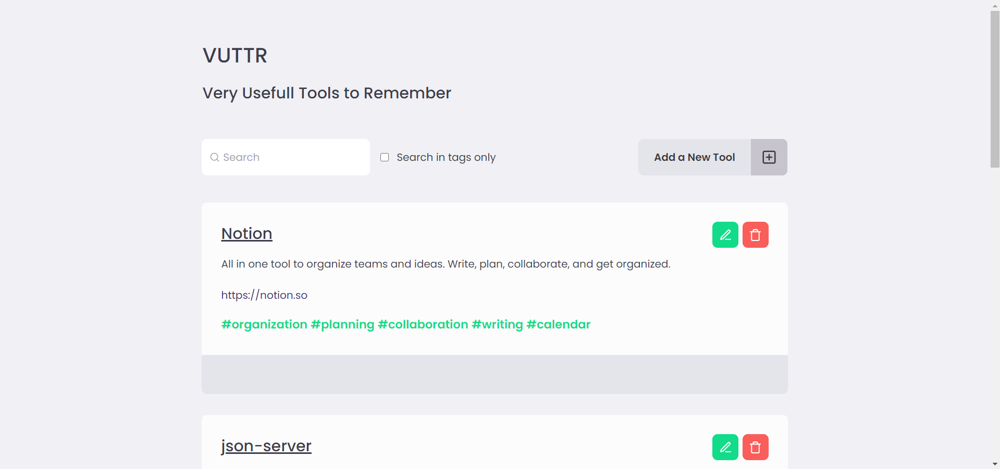
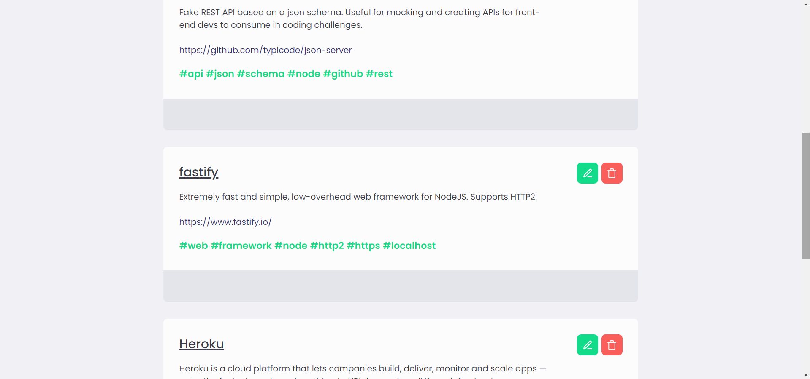
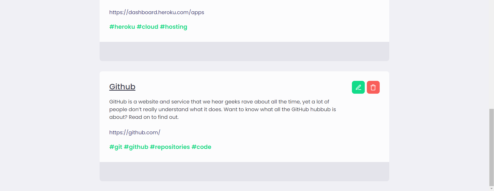
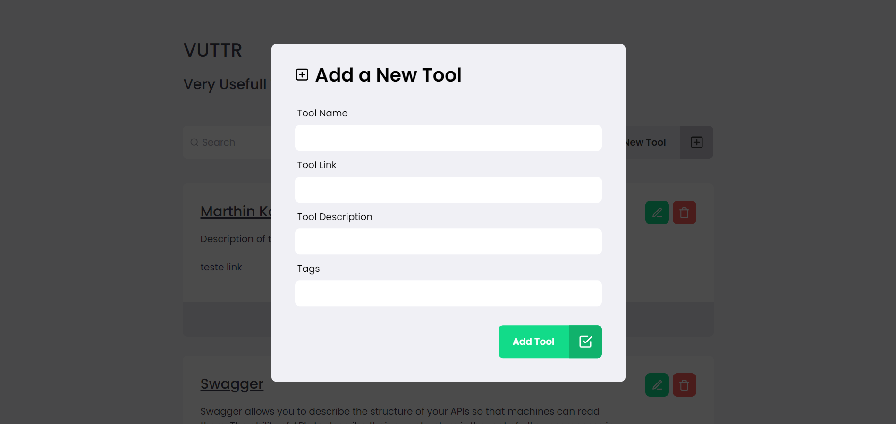
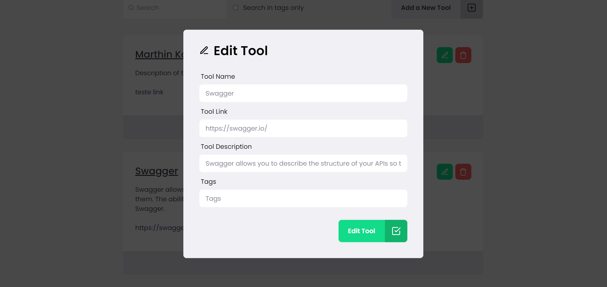
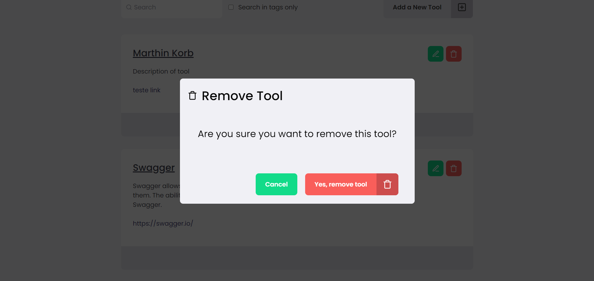

# VUTTR 🛠

**Very Usefull Tools to Remember**

Aplicação que armazena suas ferramentas favoritas

### ReactJS, Typescript, StyledComponents

----------------------------------------------------

----------------------------------------------------

## Instalação | Execução

Clone esse repositório rodando o comando:

    git clone https://github.com/MarthinKorb/VUTTR

Acesse a *Fake API* no link abaixo. Lá você terá as informações para rodar o serviço.

    https://gitlab.com/bossabox/challenge-fake-api/tree/master

----------------------------------------------------

Abra o terminal na pasta do projeto e instale as dependências rodando o comando:

    yarn

Agora vamos iniciar nosso front-end:

    yarn start

**Feito!** ✔

Agora é só adicionar as suas ferramentas favoritas na lista!

----------------------------------------------------

